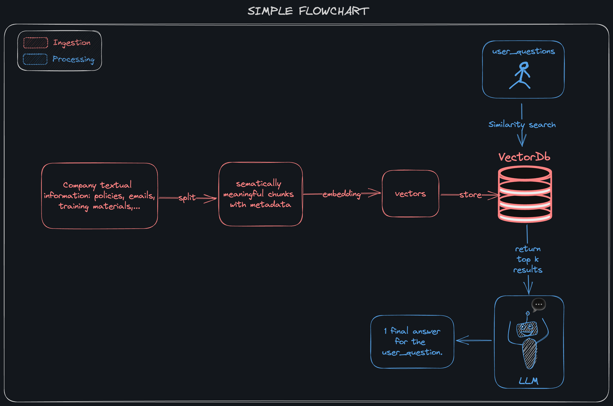

Builing an Internal AI Assistant
==============================

# Overview

The project aims to leverage the natural language processing capabilities of Large Language Models (LLM) by providing them with additional information about the specific domains we want to exploit.

In this case, the project is specifically focused on building a Company Internal AI Assistant that possesses the ability to answer questions about the company's policies and business knowledge.

  

The AI Assistant would be able to help employees easily research internal textual information using natural language. This would result in:

1. Better familiarization with the vast corpus of information within a large company for new and junior employees
2. Lowering the burden of continuously answering repetitive questions for senior employees, making the process of training their successors more efficient.
3. A valuable tool for every employee when it comes to sensitive situations that need to meticulously consider the guidance of company policies or even government laws.

# Technique

The technique used to built this AI Assistant can be simplify into the following flowchart. The flowchart contains of 2 main phases:

1. Ingestion: Converting company textual information into embeded vector & storing in a vector database for querying later.
2. Processing: Processing the users' question, using similarity search to retrieve relevant information from the vector database & then feed it to LLMs to get the final answer.

## Ingestion

> More information will be update later

## Processing

> More information will be update later

--------

<small>Project based on the <a target="_blank" href="https://drivendata.github.io/cookiecutter-data-science/">cookiecutter data science project template</a>. #cookiecutterdatascience</small>

